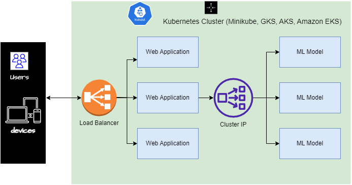
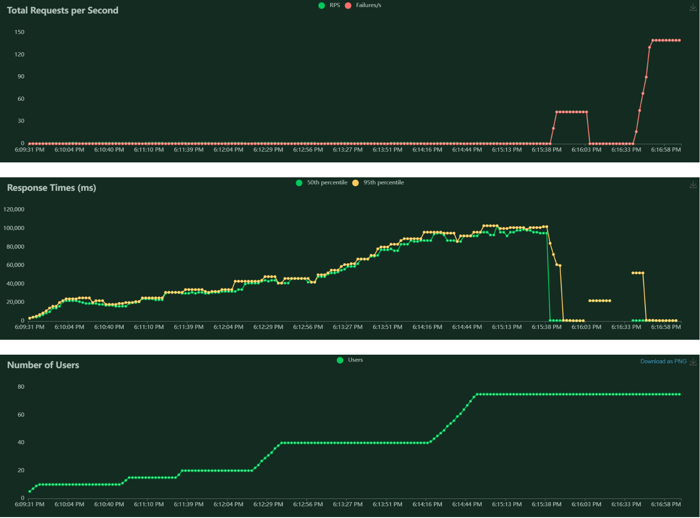
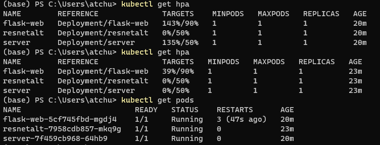
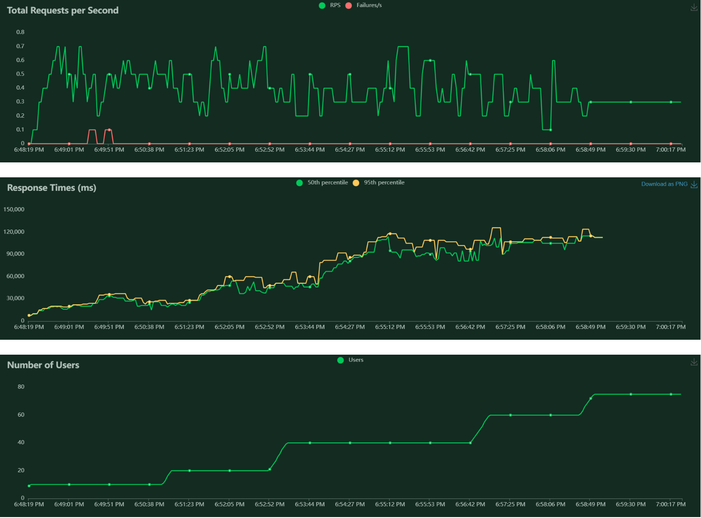
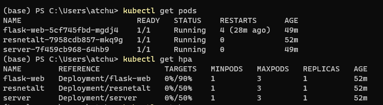
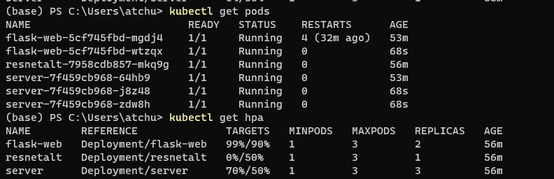
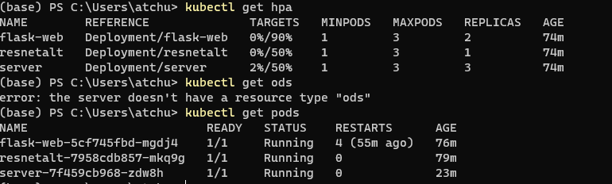
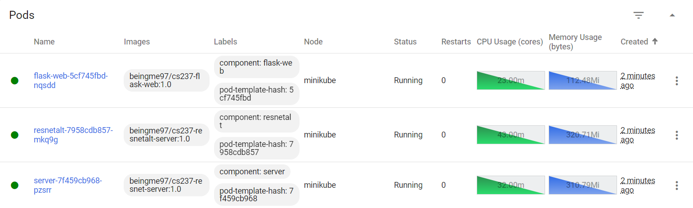
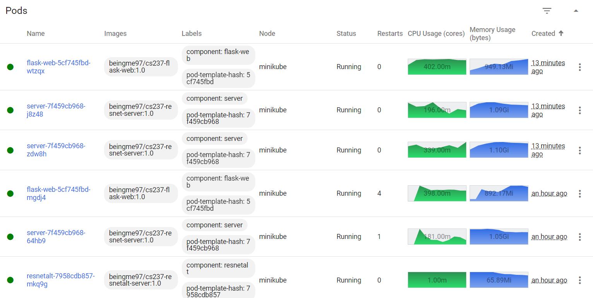

# Scalable ML Model Deployment

Atchuth Naveen Chilaparasetti
  * [LinkedIn](https://www.linkedin.com/in/atchutnaveench/) | [Website](naiveen.github.io)

## System Design
  
## For serving from Docker

```bash
docker-compose up
```

## For serving from kubernetes

Setup [MiniKube](https://minikube.sigs.k8s.io/docs/start/)

```bash
minikube addons enable metrics-server

minikube start --extra-config kubelet.EnableCustomMetrics=true
```
Deploy Kubernetes containers
```bash
kubectl apply -f k8s
```
To start the service:
```bash
minikube service web-load-balancer-service
```

## Testing Environment
  For Frontend Test, 
  
  Server Url : http://127.0.0.1:8080/home
  
  Test Url : [https://tensorflow.org/images/blogs/serving/cat.jpg](https://tensorflow.org/images/blogs/serving/cat.jpg)

  ## Running Kube Tests
  
Set up [Locust](https://locust.io/) for Stress Testing 

From the directory containing locustfile.py, run
  ```bash
  locust
  ```
Testing UI on [http://127.0.0.1:8089/](http://127.0.0.1:8089/)

# Tests

Performed tests using two model servers that take performs image calculation and a common web server that routes requests from the front end. Further directed requests to only one of the model servers and limited its max cpu utilization to 50% whereas the web server container can max cpu utilization of 90%. So, with more load, Kubernetes prefers to scale more instances of model servers. 

## With No Auto Scaling - Single instance of each

* Response rate - The response rate increases steadily and at 75 users, the system no longer can support.
  



* Resource Usage - At 75 users, the system crashes continuously and the web server goes down. But Kubernetes makes sure to restart the container as soon as it detects a failure.
  


## With Auto Scaling Enabled using Horizontal Pod scaler

* Response rate
  


* Resource Usage at the start
  


* Resource Usage at the time of scaling - Kubernetes automatically spawns two more instances for model server 1 that is in use whereas the other model server is idle. Because the web server can have resource usage up to 90%, Kubernetes adjusted the resources between the model and web servers appropriately.
  


* Resource Usage during downscaling - When no requests are being sent, Kubernetes automatically performs downscaling
  


* Resource Usage from minikube dashboard
* 
```bash
minikube dashboard
```



* Resource usage at full user load
  


# Google Cloud
As all the tests are performed locally, there is a resource constraint to perform tests on a full scale. So, we migrated the code Google cloud and performed similar tests and the results are presented. For commands to set up gcloud Kubernetes engine and the test results, refer [commands](gcp_cmds.txt) , [report](CS237_Project_Report.pdf). 
